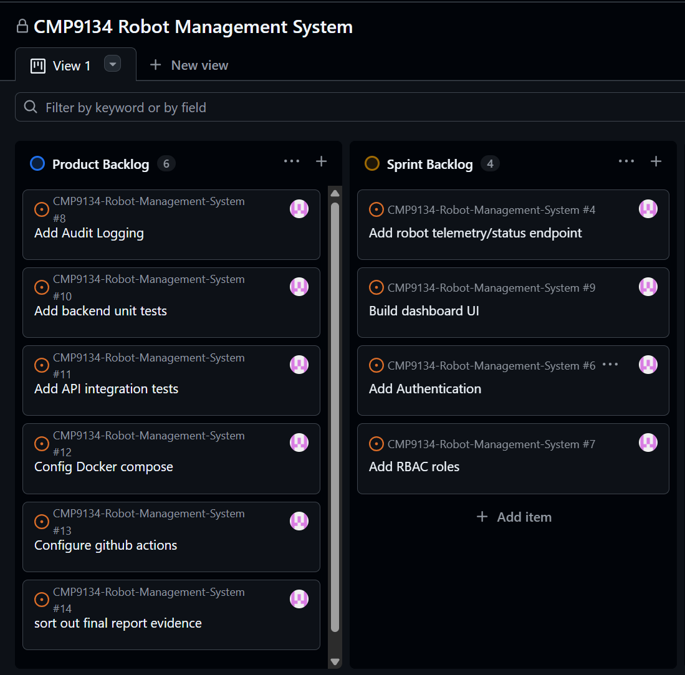
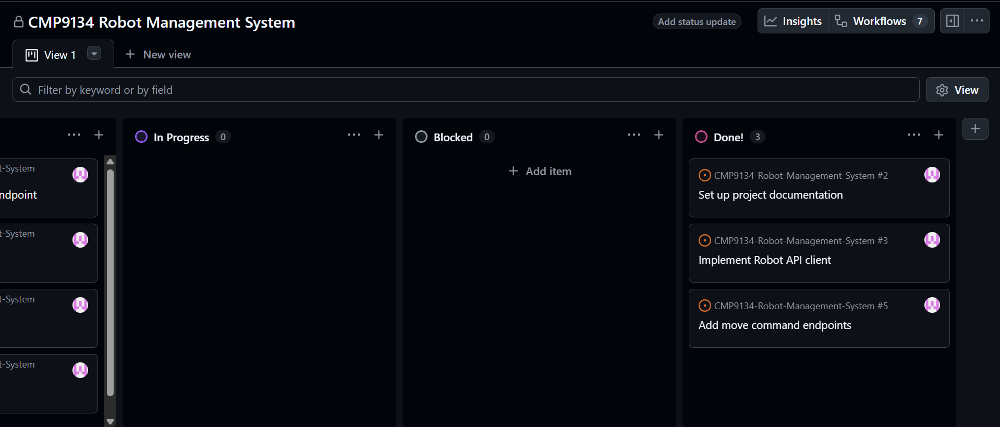

# Development log

This document is being used to show the log history of the code development:

14 May 2026:
Repository and Planning Setup:
- Initialised repository from the CMP9134 template repository.
- Created planning and governance documentation:
    - architecture notes
    - development log
    - risk register
    - AI verification log
    - privacy policy
    - threat model
- Created GitHub Issues for planned features.
- Configured GitHub Project board using a Kanban workflow.

Backend and Robot Integration:
- Reviewed provided Virtual Robot simulator documentation.
- Extended robot_client.py with:
    - retry logic
    - timeout handling
    - move/reset support
    - map/sensor client methods
- Applied a Facade-style design to isolate robot communication logic from route handlers.
- Implemented backend API routes for:
    - /api/status
    - /api/move
    - /api/reset

Testing and Verification:
- Successfully built and ran the multi-container stack using Docker Compose.
- Verified frontend access through Nginx reverse proxy on port 8080.
- Successfully tested:
    - robot status retrieval
    - move commands
    - reset commands

Challenges Encountered:
- Clarified differences between the production Docker Compose file and development overrides.
- Corrected robot sensor endpoint naming mismatch (/api/sensor vs /api/sensors).
- Removed unrelated legacy workshop routing code from the backend.

Planned Next Steps:
- Add telemetry and map endpoints.
- Improve frontend dashboard interaction.
- Implement authentication and RBAC.
- Add database-backed mission logging.

15 May 2026:
Completed:
- Added backend routes for `/api/map` and `/api/sensor`.
- Verified both endpoints through the Docker/Nginx proxy at `localhost:8080`.
- Added frontend environment map rendering to the dashboard.
- Rendered the robot's current position on the 21x21 map grid.
- Displayed obstacle cells using the simulator map data.
- Verified the robot marker updates after movement commands.
- Captured screenshots of successful dashboard and API behaviour.

CHallenges:
- Confirmed the sensor endpoint should use singular `/api/sensor`.
- Checked frontend coordinate handling so `x` maps to columns and `y` maps to rows.
- Avoided hardcoding backend ports by using relative `/api/...` paths through Nginx.

Next Steps:
- Create report skeleton.
- Begin authentication scaffolding.
- Add testing evidence.